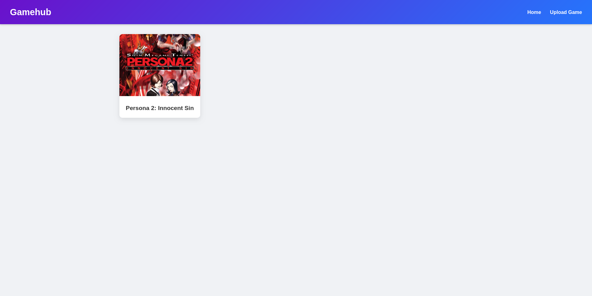
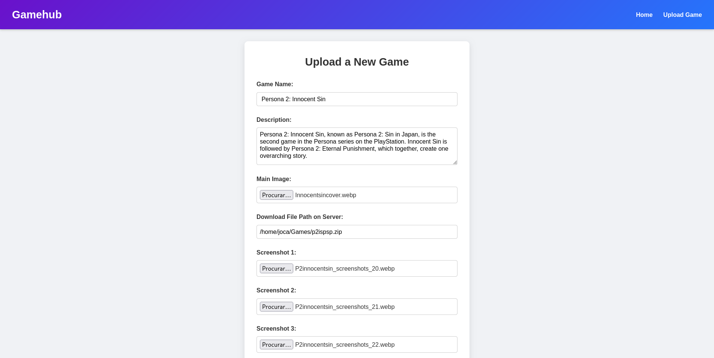
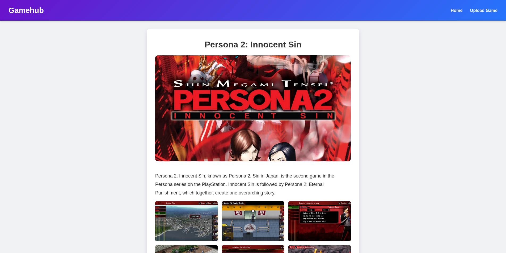

# Gamehub

A simple web app in Go for manually displaying games.

## What does this do?

It provides a simple web app to add game titles, descriptions, screenshots and downloads paths. This is a application intented to run on a server.

## And why did you do that?

All the alternatives I looked into insisted on me having a IGDB or Mobygames API keys, and I didn't really wanted that. Plus, all my games are located on my server, so I don't need an upload functionality.

## Screenshots

## Installing

- Clone the repo
- Build the project
- Edit config.json as you wish
- Run it

## Tips and Tricks

- Where are my uploaded images?

They are stored as blobs on the database itself.

- I want to move the service from a computer to another. How do I do it?

The only thing you need to backup is `gamehub.db`. Place everything on the other machine and edit every path if it changed.

- A bug happened on XXX. How do I fix it?

Please keep in mind I coded this for myself. However, feel free to open a github issue. I would be glad on fixing any confirmed bug.
